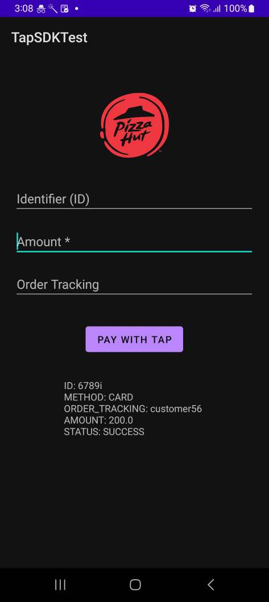

### PAYable TAP - Android Integration

[](https://play.google.com/store/apps/details?id=com.payable.taponphone)
[](https://www.payable.lk)

PAYable TAP (Tap-on-Phone) - Android Integration - [io.payable.lk/tap-sdk-demo](https://io.payable.lk/tap-sdk-demo) | [Create Issue](https://github.com/payable/tap-sdk-demo/issues/new)

[](https://github.com/payable/tap-sdk-demo/actions)

<hr>

### Initialization 

* Install `PAYable TAP` from [Google Play](https://play.google.com/store/apps/details?id=com.payable.taponphone)

<hr>

### Implementation

### Kotlin

<b>1.</b> Starting payment activity using the intent action `com.payable.action.TAP_PAYMENT` as below.

```kotlin
private fun startPayment() {

    val intent = Intent("com.payable.action.TAP_PAYMENT")
    intent.putExtra("ID", "INV-1001")
    intent.putExtra("METHOD", "CARD")
    intent.putExtra("ORDER_TRACKING", "Customer-1001")
    intent.putExtra("AMOUNT", 250.00)

    try {
        startActivityForResult(intent, 9000)
    } catch (ex: ActivityNotFoundException) {
        // PAYable TAP is not installed or outdated
    }
}
```

<b>2.</b> Override `onActivityResult` method to get the response from the `PAYable TAP`.

```kotlin
override fun onActivityResult(requestCode: Int, resultCode: Int, data: Intent?) {

    super.onActivityResult(requestCode, resultCode, data)

    if(requestCode == 9000 && data != null) {

        val id = data.getStringExtra("ID")
        val method = data.getStringExtra("METHOD")
        val orderTracking = data.getStringExtra("ORDER_TRACKING")
        val amount = data.getDoubleExtra("AMOUNT", 0.00)
        val status = data.getStringExtra("STATUS")
    }
}
```

> STATUS contains below values.

```kotlin
PENDING,
SUCCESS,
FAILED,
CANCELLED,
UNAUTHORIZED,
```

<hr>

### Java Example

```java
private void startPayment() {

    Intent intent = new Intent("com.payable.action.TAP_PAYMENT");
    intent.putExtra("ID", "INV-1001");
    intent.putExtra("METHOD", "CARD");
    intent.putExtra("ORDER_TRACKING", "Customer-1001");
    intent.putExtra("AMOUNT", 100.00);

    try {
        startActivityForResult(intent, 9000);
    } catch (ActivityNotFoundException ex) {
        // PAYable Tap is not installed or outdated
    }
}

@Override
protected void onActivityResult(int requestCode, int resultCode, Intent data) {

    super.onActivityResult(requestCode, resultCode, data);

    if (requestCode == 9000) {

        String id = data.getStringExtra("ID");
        String method = data.getStringExtra("METHOD");
        String orderTracking = data.getStringExtra("ORDER_TRACKING");
        double amount = data.getDoubleExtra("AMOUNT", 0.00);
        String status =data.getStringExtra("STATUS");
    }
}
```

### Demonstration

[](demo/recording.mp4)

PAYable TAP-on-Phone - Android Integration
